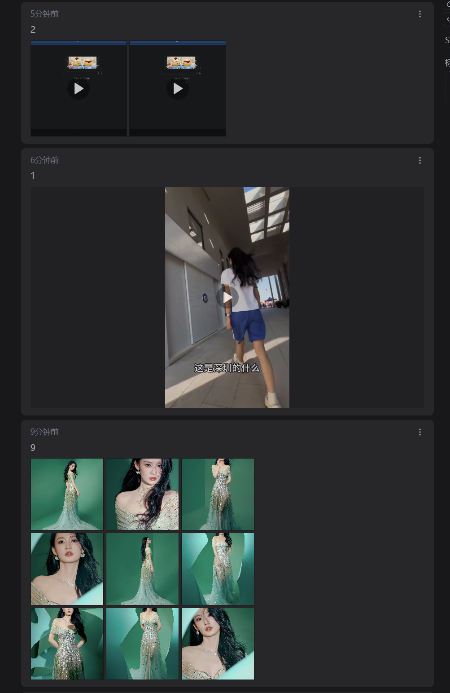
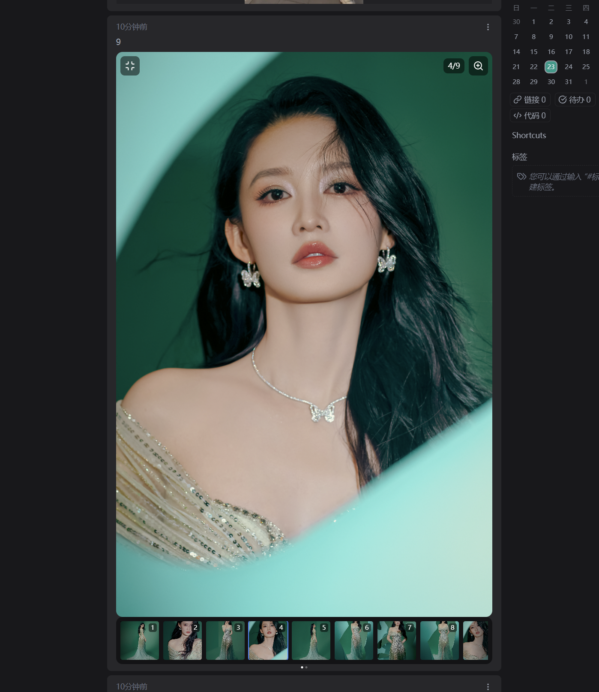
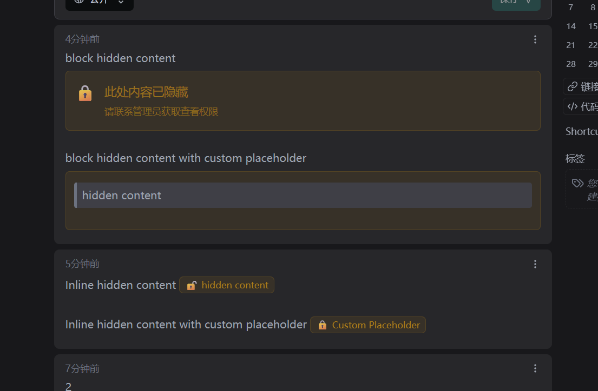

<!-- markdownlint-disable no-inline-html -->
# Note

ref: <https://github.com/usememos/memos>

## Difference

repo: <https://github.com/aliuq/memos>

1. Enhanced media display
2. Content hiding

## Build and Run

```bash
docker buildx build -t memos:dev --load . 

docker run --rm --name memos -p 15230:5230 -v ./build:/var/opt/memos memos:dev
```

## Screenshot

<details><summary>Details</summary>
<p>
 
 
 
</p>

<p>
 
</p>
</details>
